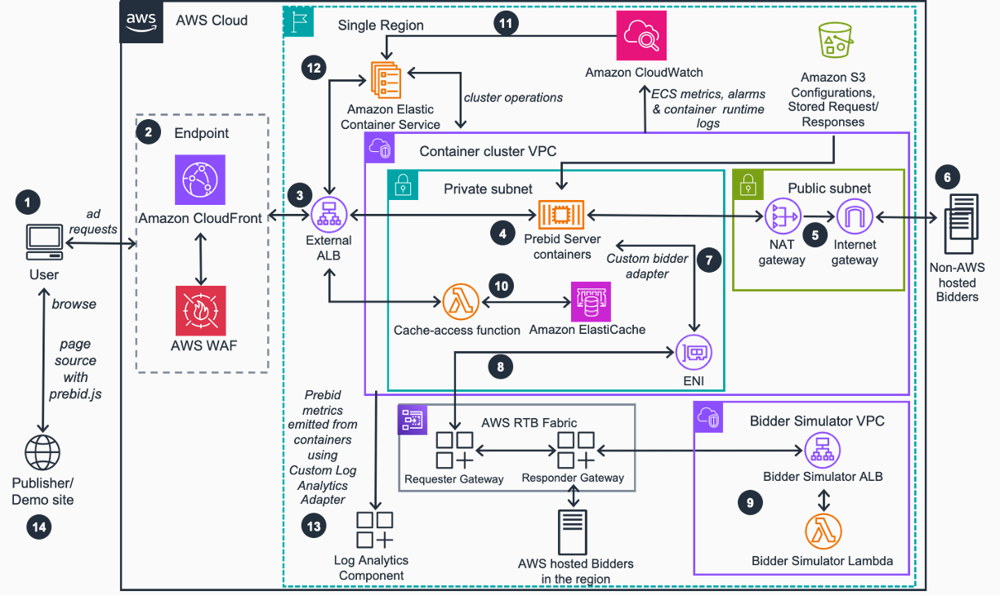

# Guidance for Deploying a Prebid Server on AWS

## Table of Contents
1. [Overview](#overview)
2. [Cost](#cost)
3. [Prerequisites](#prerequisites)
4. [Deployment Steps](#deployment-steps)
5. [Deployment Validation](#deployment-validation)
6. [Running the Guidance](#running-the-guidance)
7. [Next Steps](#next-steps)
8. [Cleanup](#cleanup)
9. [FAQ, Known Issues, Additional Considerations, and Limitations](#faq-known-issues-additional-considerations-and-limitations)
10. [Revisions](#revisions)
11. [Notices](#notices)
12. [Authors](#authors)

## Overview

Guidance for Deploying a Prebid Server on AWS helps customers deploy and operate Prebid Server, an open source solution for real-time ad monetization, in their own AWS environment. The solution enables customers with ad-supported websites to achieve scaled access to advertising revenue through a community of more than 180+ advertising platforms. Customers achieve full control over decision logic and access to transaction data, and realize AWS benefits like global scalability and pay-as-you-go economics.

This solution deploys v3.27.0 of [Prebid Server Java](https://github.com/prebid/prebid-server-java.git) with infrastructure in a single region of the AWS Cloud to handle a wide range of request traffic, and recording of auction and bid transaction data.



### Key Features

- **Prebid Server purpose built for AWS infrastructure**: Deploy Prebid Server in a scalable and cost-efficient manner with production-grade availability, scalability, and low-latency for a variety of request loads (documented up to 100,000 RPS).

- **Built-in observability**: Operational resource metrics, alarms, runtime logs, and business metrics, visualized with the Cost and Usage Dashboard powered by Amazon QuickSight and Service Catalog AppRegistry.

- **Decrease time to market**: Deployment template to establish the necessary infrastructure to get customers running within days instead of months or weeks.

- **Ownership of all operational and business data**: All data from Prebid Server metrics extract, transform, and load (ETL) to AWS Glue Data Catalog for seamless integration with various clients, such as Amazon Athena, Amazon Redshift, and Amazon SageMaker AI.

- **Integration with Service Catalog AppRegistry and Application Manager**: Centrally manage the solution's resources and enable application search, reporting, and management actions.

### Architecture

The solution uses AWS CDK and AWS Solutions Constructs to create well-architected applications. All AWS Solutions Constructs are reviewed by AWS and use best practices established by the AWS Well-Architected Framework.

## Cost

You are responsible for the cost of the AWS services used while running this Guidance. As of July 2023, the cost for running this Guidance with the default settings in the US East (N. Virginia) Region is approximately $241.50 per month for processing with no incoming bidding traffic to the solution.

We recommend creating a [Budget](https://docs.aws.amazon.com/cost-management/latest/userguide/budgets-managing-costs.html) through [AWS Cost Explorer](https://aws.amazon.com/aws-cost-management/aws-cost-explorer/) to help manage costs. Prices are subject to change. For full details, refer to the pricing webpage for each AWS service used in this Guidance.

### Sample Cost Table

The following table provides a sample cost breakdown for deploying this Guidance with the default parameters in the US East (N. Virginia) Region for one month with no incoming bidding traffic:

| AWS service  | Dimensions | Cost [USD] |
| ----------- | ------------ | ------------ |
| Amazon ECS | Operating system (Linux), CPU architecture (x86), Average duration (30 days), Number of tasks or pods (2 per month), Amount of memory allocated (4 GB), Amount of ephemeral storage allocated for Amazon ECS (20 GB) | $54.50 |
| AWS WAF | Number of Web Access Control Lists (Web ACLs) utilized (1 per month), Number of Managed Rule Groups per Web ACL (6 per month) | $15.00 |
| Elastic Load Balancing | Number of Application Load Balancers (1) | $17.00 |
| Amazon EC2 - other | Number of NAT gateways (2) DT inbound: Not selected (0 TB per month), DT outbound: Internet (<50 GB per month), DT Intra-Region: (0 TB per month) | $69.00 |
| Amazon EFS | Desired storage capacity (1 TB per month), Infrequent access requests (<2 GB per month) | $25.00 |
| Amazon S3 | S3 Standard storage | $4.00 |
| Amazon CloudWatch | Number of Standard Resolution Alarm Metrics (20), Standard logs: Data ingested (<20 GB) | $10.00 |
| Other services | Amazon CloudFront, AWS CloudTrail AWS DataSync, IAM, AWS Glue, AWS KMS, AWS Lambda, and Amazon VPC | $47.00 |
| **Total** | | **$241.50** |

## Prerequisites

### Operating System

These deployment instructions are optimized to best work on **macOS, Linux, or Windows**. The following packages and tools are required:

* [AWS Command Line Interface](https://aws.amazon.com/cli/)
* [Python](https://www.python.org/) 3.11 or newer
* [Pypi/Pip](https://pypi.org/project/pip/) 25.0 or newer
* [Poetry](https://python-poetry.org/docs/#installing-with-pipx) 2.0 or newer
* [Node.js](https://nodejs.org/en/) 16.x or newer 
* [AWS CDK](https://aws.amazon.com/cdk/) 2.140.0 or newer 
* [Amazon Corretto OpenJDK](https://docs.aws.amazon.com/corretto/) 21
* [Apache Maven](https://maven.apache.org/) 3.9.9
* [Docker](https://docs.docker.com/engine/)
* [AWS access key ID and secret access key](https://docs.aws.amazon.com/IAM/latest/UserGuide/id_credentials_access-keys.html) configured in your environment with AdministratorAccess equivalent permissions

### AWS account requirements

You need an AWS account with AdministratorAccess equivalent permissions to deploy this solution.

### aws cdk bootstrap

This Guidance uses aws-cdk. If you are using aws-cdk for the first time, please perform the bootstrapping:

```bash
cdk bootstrap --cloudformation-execution-policies arn:aws:iam::aws:policy/AdministratorAccess
```

## Deployment Steps

1. Clone the repo using command:
   ```bash
   git clone https://github.com/aws-solutions-library-samples/prebid-server-deployment-on-aws.git
   ```

2. Change to the repo folder:
   ```bash
   cd deploying-prebid-server-on-aws
   ```

3. Create a Python virtual environment for development:
   ```bash
   python3 -m venv .venv 
   source ./.venv/bin/activate 
   cd ./source 
   pip install -r requirements-poetry.txt
   poetry install
   ```

4. After introducing changes, run the unit tests to make sure the customizations don't break existing functionality:
   ```bash
   cd ../deployment
   sh ./run-unit-tests.sh --in-venv 1
   ```

5. Build the solution for deployment:

   **Prebid Server Container Image**
   
   By default, the Prebid Server container image will be built locally using Docker ([README](deployment/ecr/README.md)). If you prefer to use a remote image (from ECR or Docker Hub), set the following environment variable with your fully qualified image name before building the template:

   ```bash
   export OVERRIDE_ECR_REGISTRY=your-fully-qualified-image-name
   ```

   **Using AWS CDK (recommended)**
   
   Packaging and deploying the solution with the AWS CDK allows for the most flexibility in development:
   ```bash
   cd ../source/infrastructure

   # bootstrap CDK (required once - deploys a CDK bootstrap CloudFormation stack for assets)  
   cdk bootstrap --cloudformation-execution-policies arn:aws:iam::aws:policy/AdministratorAccess

   # build the solution 
   cdk synth

   # build and deploy the solution 
   cdk deploy
   ```

## Deployment Validation

After deploying the solution:

1. Open the CloudFormation console and verify the status of the template with the name starting with your solution name.
2. If deployment is successful, you should see an active ECS cluster with the Prebid Server tasks running.
3. Verify that the Application Load Balancer is in service.

## Running the Guidance

### Prebid Server Java Container Customization

You may choose to customize the container configuration, or create your own container to use with this solution. The infrastructure for this solution has only been tested on Prebid Server Java.

#### Deploy with Customized Prebid Server Configurations
* After deploying the CloudFormation template stack, find the S3 bucket in the CloudFormation stack outputs named `ContainerImagePrebidSolutionConfigBucket`.
1. Review the `/prebid-server/default/README.md` and `/prebid-server/current/README.md` files in the bucket.
2. Upload your changes to the `/prebid-server/current/` prefix in that bucket.
3. To update the ECS service manually, navigate to the Amazon ECS cluster associated with the deployed CloudFormation stack using the AWS Management Console. Then, update the ECS service by selecting the 'Force New Deployment' option with the new task definition version.

### Runtime and Metric Logging for ETL

The Prebid Server container shipped with this solution is configured for two types of logging:

1. Runtime logs from the Prebid Server are sent to CloudWatch logs under the `PrebidContainerLogGroup` log group.
2. Metrics output logs are written to `/mnt/efs/metrics/CONTAINER_ID/prebid-metrics.log` with a default interval of 30 seconds.
3. Rotated logs are stored at `/mnt/efs/metrics/CONTAINER_ID/archived/prebid-metrics.TIMESTAMP.log.gz` and are migrated from EFS to S3 by AWS DataSync.

### Analytics Reporter Configuration

The solution includes a custom analytics adapter for Prebid Server. By default, the analytics integration is disabled in the [prebid-config.yaml](deployment/ecr/prebid-server/default-config/prebid-config.yaml)

```yaml
analytics:
  global:
    adapters: "psdoaAnalytics"  # Specifies the custom analytics adapter
  psdoa:
    enabled: ${LOG_ANALYTICS_ENABLED}  # Enables or Disables psdoa analytics integration
```

To enable psdoaAnalytics, set LOG_ANALYTICS_ENABLED=true

```bash
export LOG_ANALYTICS_ENABLED=true
```

## Next Steps

After deploying the solution, consider the following next steps:
1. Follow the instructions in the [loadtest component readme](./source/loadtest/README.md) to deploy a demo bidder application and test it with the pre-bid server or load test the deployment.
2. **Customize Prebid Server Configuration**: Modify the configuration files in the S3 bucket to match your specific requirements.
3. **Enable Analytics**: Enable the psdoaAnalytics adapter to collect and analyze auction data.
4. **Set Up Monitoring**: Configure additional CloudWatch alarms or dashboards to monitor the performance of your Prebid Server.
5. **Integrate with Your Applications**: Update your client applications to use the deployed Prebid Server.
6. **Optimize for Cost**: Review the cost tables and adjust the infrastructure based on your actual traffic patterns.

## Cleanup

To delete the deployed solution:

1. Navigate to the AWS CloudFormation console.
2. Select the stack that was created for this solution.
3. Click "Delete" and confirm the deletion.
4. Note that some resources like S3 buckets with content may require manual deletion.

## FAQ, Known Issues, Additional Considerations, and Limitations

### Additional considerations

- This solution creates a public AWS bucket required for the use-case.
- The solution creates unauthenticated public API endpoints.

For any feedback, questions, or suggestions, please use the issues tab under the [GitHub repository](https://github.com/aws-solutions-library-samples/prebid-server-deployment-on-aws).

## Revisions
See [CHANGELOG.md](./CHANGELOG.md) for revisions.

## Notices

Customers are responsible for making their own independent assessment of the information in this Guidance. This Guidance: (a) is for informational purposes only, (b) represents AWS current product offerings and practices, which are subject to change without notice, and (c) does not create any commitments or assurances from AWS and its affiliates, suppliers or licensors. AWS products or services are provided "as is" without warranties, representations, or conditions of any kind, whether express or implied. AWS responsibilities and liabilities to its customers are controlled by AWS agreements, and this Guidance is not part of, nor does it modify, any agreement between AWS and its customers.

## Collection of operational metrics

This solution collects anonymized operational metrics to help AWS improve the quality of features of the solution.
For more information, including how to disable this capability, please see the [implementation guide](https://docs.aws.amazon.com/solutions/latest/prebid-server-deployment-on-aws/anonymized-data-collection.html).

## Authors

For a list of contributors, please see [Contributors](https://docs.aws.amazon.com/solutions/latest/prebid-server-deployment-on-aws/contributors.html).

***

Copyright Amazon.com, Inc. or its affiliates. All Rights Reserved.

Licensed under the Apache License, Version 2.0 (the "License");
you may not use this file except in compliance with the License.
You may obtain a copy of the License at

    http://www.apache.org/licenses/LICENSE-2.0

Unless required by applicable law or agreed to in writing, software
distributed under the License is distributed on an "AS IS" BASIS,
WITHOUT WARRANTIES OR CONDITIONS OF ANY KIND, either express or implied.
See the License for the specific language governing permissions and
limitations under the License.